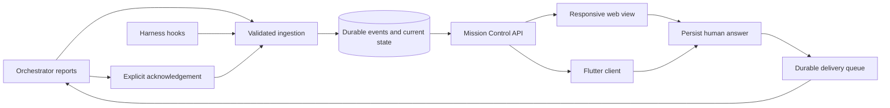

# Mission Control proposal

Status: proposed. This document describes a build; it does not implement or deploy it.

## Outcome

One view across PurpleMux workspaces answers:

- What is each workspace trying to achieve, and where has it reached?
- Which decisions or actions require the human?
- Which agents are working, waiting, disconnected, or possibly stalled?
- Did the orchestrator receive and acknowledge the human's answer?

The view works in a phone browser and subsequently in `purplemux-mobile`. Questions remain visible while the orchestrator continues independent work.

## Observed foundations

Inspected in the local repositories on 2026-09-25:

- `src/lib/standup.ts` validates compact reports with progress, blockers, and `needsHuman`. Blockers contain `what` and `needs`, without stable identities or an answer lifecycle.
- `src/lib/standup-store.ts` persists the latest 50 reports per workspace. `src/lib/status-server.ts` supplies latest reports on status synchronization.
- `src/lib/status-manager.ts` broadcasts reports and dispatches alerts. Its current report path logs persistence failures and continues; actionable records need a stronger durability contract.
- `src/lib/notification-dispatcher.ts` supplies socket and web-push channels. Its sequence counter is in memory, so it cannot serve as a durable event cursor.
- `src/pages/api/tabs/[tabId]/send.ts` and `src/lib/tab-send.ts` support authenticated human input to a live agent, including busy agents. Submission evidence does not establish that the agent consumed an answer.
- The mobile repository has standup cards, status synchronization, alerts, prompt responses, and password/cookie authentication. Its ADRs require additive server contracts and feature detection.

The supplied epic dashboard, `http://ai-server:8200/epic/`, could not be reached from this session. Its API and live deployment remain unverified. The first release should support an explicit epic link without depending on that service.

## Product surface

The landing page has three areas, in this order:

1. **Needs you:** persistent decision and action cards, grouped by workspace. Show the exact question, relevant context, affected stories, available options, the orchestrator's recommendation, age, and whether other work can continue. Answer inline with an option or free text. A blocker can instead request an external action, with an explicit “I've done this” response. Snoozing changes reminders, not resolution.
2. **Workspaces:** name, linked epic or objective, reported phase, story counts where available, active agents, open decisions, next step, and separate timestamps for last meaningful progress and last observed activity. Support work without an epic and multiple runs over a workspace's lifetime.
3. **Recent changes:** a collapsed history of meaningful transitions. Open the epic, workspace, or relevant agent from a record when more detail is needed.

Keep execution state and attention state separate. A workspace can display “Working · 2 decisions needed.” An idle terminal does not mean its epic is complete; a heartbeat does not mean progress occurred. Unknown and stale states must be visible.

The default overview is driven by work observed inside PurpleMux workspaces. An epic marked open on the board does not establish that anyone is working on it. Provide separate views for active work, waiting work, and dormant/unknown work; keep unresolved human actions visible regardless of workspace activity.

## Architecture

Add the service inside the existing PurpleMux server on `ai-server`, with a responsive `/mission-control` page and an additive API for the Flutter client. Reuse current authentication, workspace identities, status transport, and notification delivery.

Use a local SQLite database under PurpleMux's data directory, with transactions for events, current records, and delivery jobs. This is a proposed dependency; select its Node adapter against the repository's supported runtime and packaging before implementation. A separate broker is unnecessary for the initial single-server scope. Keep one shared service instance across the custom server and Next.js module graphs using the repository's existing singleton convention.

Persist before returning success or broadcasting. On database failure, reject the mutation visibly. An accepted answer must survive a server restart.

## Records and events

Minimum records:

- **Run:** workspace, objective/epic reference, orchestrator binding and generation, reported phase, lifecycle, progress timestamp.
- **Attention item:** stable ID, run, optional story, question/action type, context, options, recommendation, blocking scope, revision, lifecycle, timestamps.
- **Answer:** stable submission ID, item revision, authenticated human identity, selected option IDs/text, timestamp.
- **Delivery:** answer ID, intended run and orchestrator generation, attempts, next retry, transport outcome, acknowledgement.
- **Event:** stable producer ID, schema version, workspace/run, entity ID and revision, event type, payload, producer timestamp, server timestamp, durable server sequence.

Example event types: `run.started`, `progress.updated`, `attention.opened`, `attention.updated`, `answer.recorded`, `answer.acknowledged`, `attention.resolved`, `attention.cancelled`, and `run.finished`. Harness liveness is maintained separately from semantic progress.

Enforce workspace authorization, bounded payloads, valid transitions, and optimistic concurrency. A retried producer event or answer submission must return its existing result. An old run, item revision, or orchestrator generation must not overwrite a newer one.

Read current state through a snapshot with a consistent durable cursor; stream committed changes after that cursor. Reconnect replays missing events or returns a new snapshot when the cursor has expired. Routine history can have bounded retention; unresolved items and pending answers cannot be discarded by that retention policy.

## Answer lifecycle

Track the attention item's lifecycle separately from delivery:

- Item: open → answered → resolved, with explicit cancellation/supersession paths.
- Delivery: queued → submitted → acknowledged; retain visible retry or delivery-failure state where necessary.

Saving an answer removes it from the unanswered count but leaves it in “Awaiting agent acknowledgement.” The server delivers a compact message containing the item and answer IDs to the bound orchestrator. The orchestrator reads the persisted answer, acknowledges that ID, then explicitly resolves the item when it has applied the decision or verified the requested action.

Transport delivery is at least once. Stable IDs and agent acknowledgement prevent duplicate processing from being mistaken for a new decision; do not promise exactly-once behavior from terminal injection. Retry uncertain delivery carefully and expose uncertainty. Readiness and liveness checks must prevent sending an answer into a shell or an unrelated session.

If the orchestrator restarts or is replaced, preserve the answer and require a run-resume binding before delivery to the replacement. If the workspace is removed, retain unresolved records as orphaned items that can be cancelled or reassigned explicitly.

The server rejects a stale answer when the question changed or was resolved on another device. The UI retains the draft and displays the current question. No silent last-write-wins for competing decisions.

Provider-native permissions and interactive prompts need their existing provider-specific response mechanism. Capture a reference and validate that the exact prompt/session is still live before responding. Never replay a saved approval into a different prompt. Ship generic orchestrator questions first, then integrate native prompts using verified provider adapters.

## Keep token and notification costs low

- Harness code observes agent activity, connectivity, and process state without model calls.
- Orchestrators report when phase/progress changes, a question opens or changes, an answer is applied, or a run ends. Batch related updates in one CLI call during an already-running turn.
- Retain `purplemux standup report` as a compatible summary input. Add explicit commands for opening/updating questions, reading answers, and acknowledging/resolving them. Exact command names are part of implementation design.
- Do not turn every standup blocker into a new question by text matching. Only explicit stable IDs have a reliable lifecycle. Existing standups remain useful summaries during adoption.
- Opening or refreshing Mission Control, checking staleness, and replaying events consume no model tokens. Do not wake an orchestrator solely to narrate unchanged status.
- Notify once for a new human action, a material escalation, or a delivery failure. Dedupe by item/revision; use deterministic reminders and optional quiet hours. Progress changes stay in the dashboard.
- The durable inbox remains complete even when push delivery fails or a device is offline. Do not claim a new phone answer is saved until the server accepts it; keep local drafts if disconnected.

Update orchestrator kickoff/resume guidance as part of adoption. Existing skill instructions that require a standup for every nudge also need coordination so they do not defeat the transition-based reporting policy. Uninstrumented runs must be labelled as such; the UI cannot recover unreported prose questions reliably.

## Epic ownership

Register the epic reference explicitly when starting/resuming a run. Initially store its identifier, title, and URL. Later add an adapter once the dashboard's contract is inspected.

The epic system supplies story definitions, links, and its recorded bookkeeping state. Its open/closed status must not determine what Mission Control calls active work: existing epics often remain open after work has stopped. PurpleMux owns observed execution, attention items, human answers, and delivery. Display board status separately when useful, with source and timestamp. An epic dashboard outage must not stop discovery or question answering.

Completion also needs evidence. A quiet workspace is dormant or unknown, not completed. If a current orchestrator explicitly reports completion but the board remains open, show “Reported complete · epic closeout pending.” Formal story acceptance and closure still belong to the established epic workflow; Mission Control must not silently close epics or imply their gates passed.

## Populate existing workspaces

Ship a one-off bootstrap with the first release so existing work appears without recreating workspaces or restarting agents. This is part of the proposed implementation; no bootstrap has been executed yet.

### 1. Discover from the harness

Enumerate existing workspaces, their configured orchestrators, agent tabs, live session identities, current harness states, latest standups, and bounded recent session history. Include workspaces with orchestration disabled and workspaces without an epic. Inventory all workspaces, then prioritize live or recently active ones for deeper inspection.

An open tab, an enabled orchestration flag, or an old epic reference is not sufficient evidence of active work. Combine live agent status, recent substantive session activity, worker activity, and explicit current reports. Watchdog nudges and standup-only turns do not advance meaningful-progress timestamps. Avoid interpreting browser/terminal tabs as agent sessions.

Classify the initial evidence conservatively:

| Initial view | Evidence |
| --- | --- |
| Active | Current work reported or substantive live execution observed; mark suspected stalls separately |
| Waiting | A current human decision, external dependency, or other explicit wait; may coexist with active work |
| Dormant | No current execution observed, with historical context retained |
| Unknown | Missing, contradictory, stale, or unreadable evidence |

Recent activity is a discovery hint, not a hard expiry for long-running work. Open questions remain in the inbox even if their workspace is dormant. Show last observed activity separately from last meaningful progress.

### 2. Seed a provisional snapshot

Use deterministic extraction first: workspace/tab identities, current status, standup content, explicit epic references, and current prompt references. Inspect bounded recent context only for the current session/run; do not summarize every historical transcript.

Each inferred objective, phase, or possible unanswered question carries its source, observation time, confidence, and provisional status. A historical question is a candidate for confirmation until subsequent answers and the live run are checked. Never turn old permission text into an actionable approval.

Where deterministic extraction cannot identify the work, a bounded one-off summarization may be used during bootstrap. Cache by session identity and content cursor so a retry does not pay to interpret the same evidence twice. Unavailable context leaves an explicit unknown instead of an invented summary.

### 3. Reconcile once with each live orchestrator

Request one compact snapshot from each existing live orchestrator: current objective/epic, work in progress and worker assignments, phase, unresolved human questions, external blockers, completed work awaiting closeout, and next step. Include provisional findings so the orchestrator can confirm or correct them. Use the existing session's context; do not start replacement agents solely to reconstruct history.

Queue this request at a safe interaction point, without interrupting work or injecting text into a provider permission prompt. Batch and stagger requests across workspaces. Record delivery and completion under a bootstrap ID; a retry must not trigger another successful snapshot turn. Missing responses remain provisional and visible, with no repeated wake-up loop. A workspace without a live orchestrator keeps its observed snapshot and can confirm it on its next real agent turn.

Confirmed current questions become durable attention items. Historical candidates remain in a separate “Possible outstanding questions” review area until confirmed or dismissed, preventing either silent loss or a flood of stale action cards. Send at most one bootstrap digest rather than an alert for every imported item.

### 4. Cut over to events without losing concurrent work

Begin collecting live changes before discovery, capture a bootstrap boundary, and reconcile snapshots against entity revisions and session generations. A bootstrap result must never overwrite a newer progress update, answer, or resolution. Re-running bootstrap uses recorded source IDs to merge existing records and fills gaps without duplicating runs, questions, or notifications. Ambiguous run/epic associations remain unassigned until confirmed.

After the initial reconciliation, existing runs adopt the same transition-based reporting as new runs. Harness hooks continue to capture activity without model calls. A lightweight deterministic discovery scan can identify newly created or uninstrumented workspaces; it must not repeatedly summarize sessions.

### 5. Surface closeout debt separately

Show “Closeout pending” when there is an explicit completion report or verified completion evidence that conflicts with epic bookkeeping. Link the supporting evidence and the epic. Treat unverified claims as reported completion, not verified acceptance. Old open epics with no workspace evidence stay out of the active-work count. This identifies cleanup work without making a board cleanup a prerequisite for useful Mission Control.

## Build sequence

1. Durable records, event validation, scoped CLI/API, replay, answer delivery, and restart recovery.
2. Responsive Mission Control page with the complete question → answer → acknowledgement flow and current workspace summaries. Include bootstrap discovery, provisional snapshots, and the reconciliation flow so existing work is visible at launch. This is the first useful release and works from a phone browser over the existing server connection.
3. Orchestrator kickoff/resume adoption, selective alerts, and instrumentation of relevant harness transitions. Exercise bootstrap on scratch workspaces, then populate existing workspaces once with bounded orchestrator reconciliation.
4. Flutter inbox and workspace overview using the same API, cached reads, drafts, deep links, and additive feature detection.
5. Epic metadata adapter and provider-native prompt integration after their contracts are verified.

Avoid expanding the first release into scheduling, automatic reprioritization, or general agent control. Its success is dependable visibility and human decisions reaching the right run.

## Acceptance evidence required before shipping

- An unanswered question remains visible after later progress reports, browser reload, and server restart.
- A workspace can keep working while one story waits for a human decision.
- Answering from web or mobile produces one durable answer despite retries/double taps; a second device sees the same state.
- Crash injection between answer persistence, delivery, and acknowledgement causes no lost answer or false resolution.
- Agent replacement, deleted tabs/workspaces, stale item revisions, and expired native prompts cannot redirect a response to unrelated work.
- Reconnect reconstructs state correctly after missed events; retention never removes unresolved work.
- An idle/disconnected agent is distinguished from a blocked/completed run, and stale progress is marked honestly.
- Cross-workspace agent writes are rejected. Human clients use authenticated sessions; CLI secrets stay off the phone.
- An unchanged run produces no repeated progress alerts or model wake-ups from Mission Control.
- Existing standup clients continue working and an older server yields an explicit unsupported-feature state in the new mobile UI.
- Bootstrap discovers existing work without an epic or an enabled orchestrator, and does not count an idle tab or an old open epic as active work.
- A live worker keeps its workspace visible even when its orchestrator is idle; genuine human waits remain visible after activity goes quiet.
- A historical question answered later in the same session is not imported as a new open action; uncertain candidates remain labelled for review.
- Re-running or resuming bootstrap creates no duplicate runs, questions, snapshot turns, or notification floods, and never overwrites newer live events.
- Missing context or an unreachable orchestrator leaves a visible provisional/unknown state; no replacement agents or unbounded transcript scans are launched.
- Explicit completion with stale board bookkeeping appears as closeout pending; inactivity alone never marks work complete or closes an epic.

Confidence: high in the identified standup/inbox gap and reusable local components; moderate in implementation scope until SQLite packaging and answer-delivery integration are exercised; unknown for the epic dashboard's API and current live configuration.
